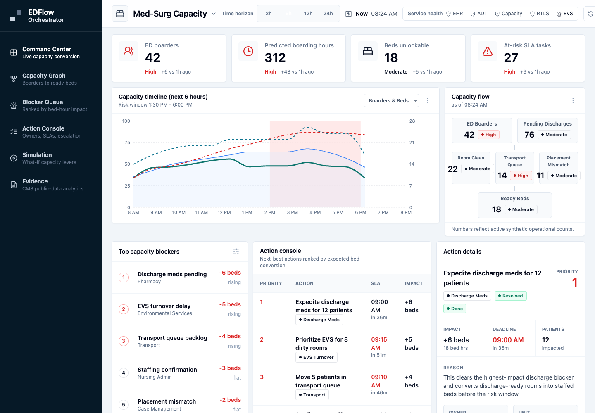
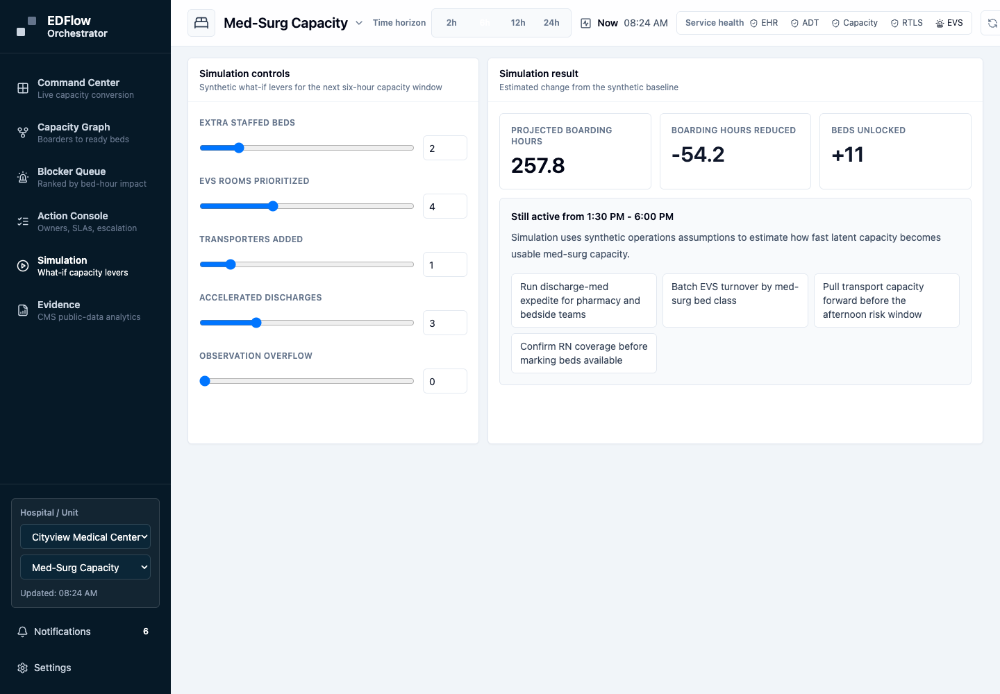
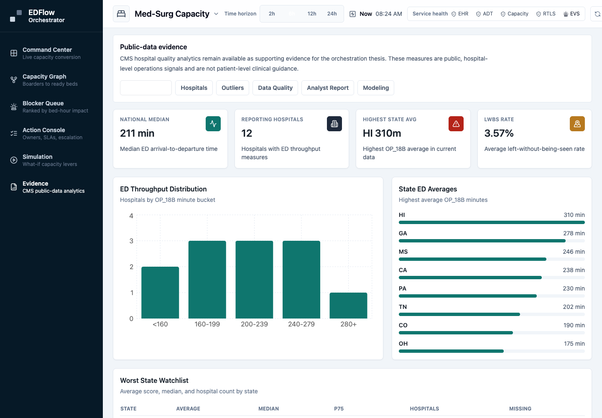

# EDFlow Orchestrator

A hospital capacity orchestration prototype for reducing Emergency Department boarding by converting predicted demand into accountable bed-conversion actions.

This is **not** an AI doctor, clinical chatbot, or medical recommendation tool. The goal is to build a real operations platform that models hospital-wide capacity friction, recommends accountable tasks, and keeps public CMS analytics available as supporting evidence.

---

## Product Thesis

Most hospitals already have dashboards, bed boards, EHR workflows, and some command-center tooling.
What they still struggle with is turning prediction into action.

This project is not another passive ED dashboard.
It is a hospital capacity orchestration system.

The goal is to reduce ED boarding and hospital-wide access block by converting predicted demand into accountable operational actions across:

- discharge planning
- bed management
- environmental services
- patient transport
- case management
- staffing and placement pathways

We are not trying to make hospitals more aware of crowding.
We are trying to make them faster at creating real capacity.

---

## Project Summary

EDFlow Orchestrator answers:

> Which exact action creates the most usable med-surg capacity in the next 30, 60, or 120 minutes, who owns it, what dependency blocks it, and when should the system escalate?

The first product wedge is:

> ED boarder -> inpatient med-surg bed placement

The existing CMS analytics layer answers a supporting evidence question:

> Which hospitals and states show the worst Emergency Department throughput, what trends or outliers exist, and how can analysts monitor these metrics with clean, auditable data?

The final product should demonstrate:

- Synthetic hospital operations event modeling
- Capacity graph and blocker ranking
- Action ownership, SLA tracking, and escalation
- What-if simulation for bed-conversion levers
- Data ingestion
- Data cleaning
- Database design
- ETL/ELT pipelines
- Healthcare analytics
- Dashboarding
- API development
- Statistical analysis
- Practical modeling for forecasting, classification, clustering, and outlier detection

---

## Target Users

This app is designed for:

- Healthcare data analysts
- Hospital operations teams
- Quality improvement teams
- Public health researchers
- Data engineering recruiters
- Healthcare analytics recruiters

This app is **not** designed for doctors during active patient care.

---

## Core Data Sources

Use public healthcare datasets, especially the CMS Provider Data Catalog.

### Primary Dataset

- **CMS Timely and Effective Care - Hospital**  
  https://data.cms.gov/provider-data/dataset/yv7e-xc69

### Relevant CMS Measures

- **OP-18b:** Median time from Emergency Department arrival to Emergency Department departure for discharged ED patients
- **OP-18c:** Median time for psychiatric/mental health Emergency Department patients
- **OP-22:** Left without being seen
- **OP-23:** Head CT/MRI result timing for acute stroke or hemorrhage patients

### Optional Supporting Datasets

- CMS Hospital General Information
- CMS Hospital Overall Star Ratings
- CMS state-level Timely and Effective Care data
- CDC or AHRQ datasets if useful later

---

## Tech Stack

### Backend

- Python
- FastAPI
- PostgreSQL
- SQLAlchemy
- Pydantic
- pandas
- pytest

### Data Engineering

- Python ETL scripts
- dbt, preferred if useful
- Great Expectations or custom data validation
- Docker Compose

### Frontend

- React
- TypeScript
- Tailwind CSS
- Recharts or Tremor
- Axios or fetch for API calls

### Analytics and Modeling

- scikit-learn
- statsmodels
- XGBoost only if useful
- No generative AI required

---

## Core Features

### 0. Capacity Orchestration MVP

Build a simulated med-surg capacity command center that tracks:

1. Admitted ED boarders awaiting inpatient placement
2. Pending discharges that can create usable beds
3. EVS room turnover state
4. Transport queue pressure
5. Staffing confirmation and placement mismatch blockers
6. Recommended actions with owner, deadline, dependency, expected capacity impact, and escalation state

The main screens are:

- **Command Center:** six-hour boarding pressure timeline, capacity flow graph, ranked blockers, and action details
- **Capacity Graph:** boarder-to-ready-bed dependency map
- **Blocker Queue:** operational blockers ranked by estimated bed-hour impact
- **Action Console:** next-best actions with owner, SLA, dependency, escalation, and state updates
- **Simulation:** what-if scenarios for staffed beds, EVS prioritization, transport, accelerated discharges, and observation overflow
- **Evidence:** CMS public-data analytics that support the product thesis

The prototype uses synthetic operations data only. It does not include real EHR, ADT, FHIR, or patient-level data.

---

### 1. Data Pipeline

Build scripts that:

1. Download or load CMS CSV data
2. Store raw data in PostgreSQL
3. Clean and transform hospital quality measures
4. Normalize hospital IDs, states, measure names, measure values, dates, and scores
5. Create analytics-ready tables
6. Run data quality checks

### Raw Tables

- `raw_hospital_general_info`
- `raw_timely_effective_care`
- `raw_measure_metadata`

### Clean Tables

- `dim_hospital`
- `dim_location`
- `dim_measure`
- `fact_ed_quality_measure`
- `fact_state_ed_summary`

---

### 2. Backend API

Build FastAPI endpoints:

- `GET /health`
- `GET /capacity/command-center`
- `GET /capacity/blockers`
- `GET /capacity/actions`
- `PATCH /capacity/actions/{action_id}`
- `POST /capacity/simulate`
- `GET /hospitals`
- `GET /hospitals/{provider_id}`
- `GET /measures`
- `GET /ed/overview`
- `GET /ed/state-summary`
- `GET /ed/outliers`
- `GET /ed/hospital-comparison`
- `GET /data-quality`

The API should return clean JSON for the frontend. Capacity endpoints use synthetic operational data; CMS endpoints use seed data or CMS-derived tables.

---

### 3. Dashboard And Evidence Layer

Build the main React app around EDFlow Orchestrator:

- Command Center
- Capacity Graph
- Blocker Queue
- Action Console
- Simulation
- Evidence

The Evidence area preserves the CMS analytics pages:

Build a React dashboard with the following evidence pages.

#### National Overview

Show:

- Average ED throughput by state
- Best and worst states
- National median ED time
- Distribution of ED performance
- Number of reporting hospitals

#### Hospital Explorer

Allow users to search by:

- Hospital name
- State
- Provider ID

Show:

- Hospital ED measures
- State average
- National average
- Percentile ranking
- Available measure history

#### Outlier Finder

Show:

- Hospitals with unusually high ED wait/departure times
- Hospitals with high left-without-being-seen rates
- Hospitals missing key ED data
- State-level outliers

#### Data Quality Monitor

Show:

- Raw row counts
- Cleaned row counts
- Missing value percentages
- Invalid numeric fields
- Latest ingestion timestamp
- Failed validation checks

#### Analyst Report

Show:

- Key insights
- Charts
- Summary statistics
- Correlations
- Limitations of the data

---

## Analytics Requirements

The project should include a Jupyter notebook or written report that answers:

1. Which states have the highest median ED throughput times?
2. Which hospitals are worst-performing outliers?
3. How much variation exists within each state?
4. Do hospital ratings or hospital types correlate with ED performance?
5. Which measures have the most missing data?
6. Are there clusters of hospitals with similar ED performance profiles?

Use clear charts and written interpretation.

---

## Modeling Phase

The modeling phase should be practical, explainable, and focused on healthcare operations analytics.

The goal is **not** to predict individual patient outcomes or make clinical decisions. The goal is to model hospital-level Emergency Department performance using public CMS quality data.

### Modeling Objective

Build models that help answer:

> Which hospitals are performing unusually poorly on ED throughput, which factors are associated with poor performance, and can we classify or forecast operational risk using clean hospital-level data?

### Modeling Tasks

Implement at least **3** of the following tasks.

---

### 1. Outlier Detection

Identify hospitals with unusually high ED throughput times or unusually high left-without-being-seen rates.

#### Methods

- z-score outlier detection
- IQR-based outlier detection
- Isolation Forest, optional

#### Outputs

- Top outlier hospitals nationally
- Top outlier hospitals by state
- Outlier severity score
- Explanation of why each hospital was flagged

---

### 2. Hospital Performance Clustering

Cluster hospitals into similar ED performance groups.

#### Possible Features

- Median ED departure time
- Left-without-being-seen percentage
- Hospital rating
- Hospital ownership type
- Emergency services availability
- State or region
- Number of reported measures
- Missingness rate

#### Methods

- K-Means
- Hierarchical clustering
- PCA for visualization, optional

#### Outputs

- Hospital cluster labels
- Cluster summary table
- Interpretation of each cluster

#### Example Cluster Labels

- High-performing hospitals
- Average throughput hospitals
- High-delay hospitals
- High-missing-data hospitals
- High-risk ED bottleneck hospitals

---

### 3. Regression Analysis

Analyze which hospital-level features are associated with worse ED throughput.

#### Target Variable Examples

- OP-18b median ED arrival-to-departure time
- OP-22 left-without-being-seen percentage

#### Possible Predictors

- Hospital ownership
- Hospital type
- Emergency services availability
- State
- Overall hospital rating
- Other quality measures
- Reporting completeness

#### Methods

- Linear regression
- Ridge regression
- Random forest regression, optional

#### Outputs

- Feature importance
- Coefficient table
- Model performance metrics
- Explanation of limitations

---

### 4. Classification Model

Classify whether a hospital is at high risk for poor ED throughput.

#### Target

- `high_ed_delay = 1` if hospital is in the top 25% nationally for ED departure time
- `high_ed_delay = 0` otherwise

#### Possible Models

- Logistic regression
- Random forest classifier
- XGBoost classifier, optional

#### Metrics

- Accuracy
- Precision
- Recall
- F1 score
- ROC-AUC
- Confusion matrix

#### Outputs

- Predicted risk category
- Probability of high ED delay
- Most important features

---

### 5. Time-Based Trend Modeling

If multiple CMS reporting periods are available, model ED performance trends over time.

#### Tasks

- Compare current vs. previous reporting periods
- Identify improving hospitals
- Identify worsening hospitals
- Forecast state-level ED throughput trends, optional

#### Methods

- Rolling averages
- Trend slopes
- Simple time-series forecasting
- Prophet or ARIMA only if useful

#### Outputs

- Trend charts
- Improving and worsening hospital lists
- State-level performance movement

---

## Modeling Deliverables

The modeling phase should produce:

- `notebooks/modeling_ed_performance.ipynb`
- `backend/app/services/modeling_service.py`
- `pipelines/build_modeling_dataset.py`
- `docs/modeling_methodology.md`
- `docs/modeling_results.md`

The notebook should include:

- Feature engineering
- Train/test split
- Baseline model
- Final model
- Metrics
- Charts
- Interpretation
- Limitations

The backend should expose modeling results through API endpoints.

---

## Modeling API Endpoints

Add these FastAPI endpoints:

- `GET /models/outliers`
- `GET /models/clusters`
- `GET /models/high-risk-hospitals`
- `GET /models/feature-importance`
- `GET /models/model-summary`

Each endpoint should return clean JSON that can be used by the frontend dashboard.

---

## Modeling Dashboard Page

Add a dashboard section called **ED Risk Modeling**.

This page should show:

- High-risk hospital table
- Outlier hospitals
- Cluster breakdown
- Feature importance chart
- Model performance metrics
- Confusion matrix, if classification is used
- Clear explanation of what the model does and does not mean

Include this warning in the UI:

> This model is for healthcare operations analysis only. It does not make clinical decisions or patient-level predictions.

---

## Modeling Rules

The modeling layer must follow these rules:

- Use hospital-level or state-level data only
- Avoid patient-level clinical prediction
- Avoid diagnosis or treatment recommendations
- Prioritize explainable models
- Include model limitations
- Include data quality warnings
- Compare every model to a simple baseline
- Do not overclaim accuracy or usefulness

The modeling should support analysts, not replace healthcare professionals.

---

## Project Structure

```text
edflow-analytics/
  README.md
  docker-compose.yml
  .env.example
  .gitignore

  backend/
    app/
      main.py
      api/
        routes_capacity.py
        routes_hospitals.py
        routes_ed.py
        routes_quality.py
        routes_models.py
      db/
        database.py
        models.py
      schemas/
        hospital.py
        measure.py
        ed.py
        modeling.py
        capacity.py
      services/
        capacity_service.py
        hospital_service.py
        ed_service.py
        modeling_service.py
      tests/
        test_api.py
        test_models.py

  frontend/
    package.json
    src/
      App.tsx
      main.tsx
      components/
        MetricCard.tsx
        ChartCard.tsx
        HospitalSearch.tsx
        capacity/
      pages/
        CommandCenter.tsx
        CapacityGraph.tsx
        BlockerQueue.tsx
        ActionConsole.tsx
        Simulation.tsx
        Evidence.tsx
        Overview.tsx
        HospitalExplorer.tsx
        Outliers.tsx
        DataQuality.tsx
        AnalystReport.tsx
        EDRiskModeling.tsx
      api/
        client.ts

  pipelines/
    ingest_cms.py
    transform_cms.py
    validate_data.py
    load_to_postgres.py
    build_modeling_dataset.py

  dbt/
    models/
      staging/
      marts/

  notebooks/
    ed_throughput_analysis.ipynb
    modeling_ed_performance.ipynb

  docs/
    architecture.md
    data_dictionary.md
    methodology.md
    findings.md
    modeling_methodology.md
    modeling_results.md
```

---

## Development Phases

### Phase 1: Setup

- Create repo structure
- Add Docker Compose with PostgreSQL
- Add FastAPI backend
- Add React frontend
- Add README and docs folder

### Phase 2: Data Ingestion

- Load CMS Timely and Effective Care data
- Load hospital general information
- Save raw data to PostgreSQL
- Preserve raw tables exactly

### Phase 3: Data Cleaning

- Filter ED-related measures
- Parse numeric measure values
- Normalize hospital IDs and state codes
- Create clean dimensional schema
- Add data quality checks

### Phase 4: Backend API

- Build endpoints for hospitals, measures, ED summaries, and data quality
- Add pagination/filtering where useful
- Add API documentation via FastAPI docs

### Phase 5: Dashboard

- Build national overview
- Build hospital search/explorer
- Build outlier dashboard
- Build data quality monitor
- Build analyst report page

### Phase 6: Analytics

- Create notebook with real findings
- Add charts
- Add summary statistics
- Add written methodology
- Add limitations section

### Phase 7: Modeling

- Build modeling dataset from cleaned CMS tables
- Engineer hospital-level features
- Implement outlier detection
- Implement clustering
- Implement regression or classification model
- Evaluate models with clear metrics
- Save model results to database
- Expose model outputs through API
- Display model outputs in dashboard

### Phase 8: Polish

- Add tests
- Add screenshots
- Add deployment instructions
- Add final resume bullets
- Add demo script
- Clean UI

---

## Acceptance Criteria

The project is complete when:

- Synthetic med-surg capacity command center runs locally
- Capacity timeline, flow graph, blocker queue, action console, and simulation are visible in the frontend
- Capacity API exposes command-center, blocker, action, action-update, and simulation contracts
- Action state updates are reflected in the UI
- CMS data can be ingested reproducibly
- Raw and cleaned tables exist in PostgreSQL
- FastAPI backend serves real analytics endpoints
- Evidence tab displays real hospital ED metrics
- Evidence tab supports hospital/state comparison
- Outlier analysis works
- Data quality page shows pipeline health
- Modeling outputs are generated and exposed through the API
- Evidence modeling tab displays model results
- Notebook/report contains meaningful findings
- README explains setup, methodology, and results
- Project can be run locally with Docker Compose

---

## Design Philosophy

This project should feel like a real healthcare operations product with a credible data engineering evidence layer.

### Prioritize

- Closed-loop operational action
- Bed-conversion workflows
- Clear owners, SLAs, dependencies, and escalation
- Real public data
- Clean schema design
- Reproducible pipelines
- Explainable metrics
- Operational insights
- Recruiter-readable documentation

### Avoid

- Fake AI
- Clinical decision-making
- Unsupported claims
- Unnecessary complexity
- Generic dashboard filler
- Diagnosis prediction
- Treatment recommendations
- Doctor chatbot features

---

## Resume Bullet Target

Built EDFlow Orchestrator, a React/FastAPI hospital capacity operations prototype that models med-surg bed conversion for ED boarders, ranks throughput blockers by estimated bed-hour impact, simulates capacity levers, and preserves CMS hospital-quality analytics as a public-data evidence layer.

---

## Real-World Rollout Roadmap

The app is currently ready as a deployable prototype. The next phase is making it reliable as a public web app, then useful as an operations product.

### Phase 9: Public Deployment

- Deploy the FastAPI backend to Render using `render.yaml`
- Deploy the Vite frontend to Vercel with `frontend/` as the root directory
- Set `VITE_API_BASE_URL` in Vercel to the Render backend URL
- Set `CORS_ORIGINS` in Render to the Vercel frontend URL plus localhost development URLs
- Verify `/health`, `/capacity/command-center`, `/capacity/actions`, `/capacity/simulate`, and the Evidence pages from the public frontend
- Keep GitHub Actions green before promoting changes

### Phase 10: Production Hardening

- Add authentication before exposing any non-demo operational action workflow
- Add database migrations instead of relying only on automatic table creation
- Move action state from in-memory synthetic data into persistent database tables
- Add structured logs, error monitoring, uptime checks, and basic usage analytics
- Add frontend code splitting to reduce the current dashboard bundle size
- Add rate limiting and stricter CORS for any public demo URL
- Add a visible data-mode banner when the app is running on synthetic data

### Phase 11: Real Operations Functionality

- Replace synthetic capacity events with a normalized operations event model
- Add connectors or import jobs for ADT-like events, bed status, EVS turnover, transport queues, staffing state, and discharge barriers
- Keep patient-identifying information out of the prototype unless a proper compliance, security, and data-governance plan exists
- Store action assignments, notes, escalations, and completion history
- Add role-based views for bed management, EVS, transport, pharmacy, nursing admin, and case management
- Validate recommendations with operations users before calling the product real workflow automation

### Phase 12: Hospital-Grade Readiness

- Complete HIPAA/security review before handling real patient or hospital operations data
- Add audit logs for every action update and escalation
- Add backup/restore, incident response, and data-retention policies
- Add test data generation, staging, and production environments
- Document integration contracts for FHIR-friendly workflow resources, HL7/ADT feeds, or CSV imports
- Run pilot validation against historical, de-identified operations data

The immediate deploy target is still a public synthetic-data demo. Real-world highest functionality requires persistent workflow state, authenticated users, monitored infrastructure, and validated hospital operations integrations.

---

## Codex Build Instruction

Implement this project step by step.

Start by creating:

1. Repo structure
2. Docker Compose PostgreSQL setup
3. FastAPI backend skeleton
4. React frontend skeleton
5. Initial CMS ingestion pipeline

After the data pipeline and dashboard are working, add the modeling phase. The modeling phase should include:

- Outlier detection
- Hospital clustering
- Regression or classification modeling
- Model evaluation
- API endpoints for model outputs
- Dashboard visualizations

Do **not** add:

- Generative AI
- Clinical decision-support
- Diagnosis prediction
- Treatment recommendation features
- Doctor chatbot functionality

Focus on capacity orchestration, healthcare operations modeling, clean APIs, synthetic workflow simulation, data engineering, and evidence dashboards.

---

## Current Implementation Quickstart

This repository now contains the first runnable EDFlow Orchestrator slice:

- FastAPI backend with capacity orchestration, hospital, ED analytics, data quality, and modeling endpoints
- React/TypeScript product with Command Center, Capacity Graph, Blocker Queue, Action Console, Simulation, and Evidence pages
- Docker Compose PostgreSQL setup
- CMS Provider Data Catalog ingestion, transformation, validation, loading, and modeling pipeline scripts
- Synthetic operations data and local CMS seed data so the app runs before any live CMS ingest

### Rollout Assets

- Deployment guide: `docs/deployment.md`
- Demo script: `docs/demo_script.md`
- Test plan: `docs/test_plan.md`
- Resume bullets: `docs/resume_bullets.md`
- Screenshots: `docs/assets/screenshots/`

### Screenshots

Command Center:



Simulation:



Evidence:



### Run With Docker Compose

```bash
docker compose up --build
```

Then open:

- API: http://localhost:8000/docs
- Dashboard: http://localhost:5173

### Run Locally

Backend:

```bash
cd backend
python -m venv .venv
source .venv/bin/activate
pip install -r requirements.txt
uvicorn app.main:app --reload
```

Frontend:

```bash
cd frontend
npm install
npm run dev
```

### Run The CMS Pipeline

```bash
python pipelines/ingest_cms.py --ed-only --max-rows 0
python pipelines/transform_cms.py
python pipelines/validate_data.py
python pipelines/build_modeling_dataset.py
```

Use `--max-rows 15000` during development for a smaller CMS pull.

### Capacity API Smoke Checks

```bash
curl http://localhost:8000/capacity/command-center
curl http://localhost:8000/capacity/blockers
curl -X POST http://localhost:8000/capacity/simulate \
  -H "Content-Type: application/json" \
  -d '{"extra_staffed_beds":2,"evs_rooms_prioritized":4,"transporters_added":1,"accelerated_discharges":3,"observation_overflow":0}'
```
